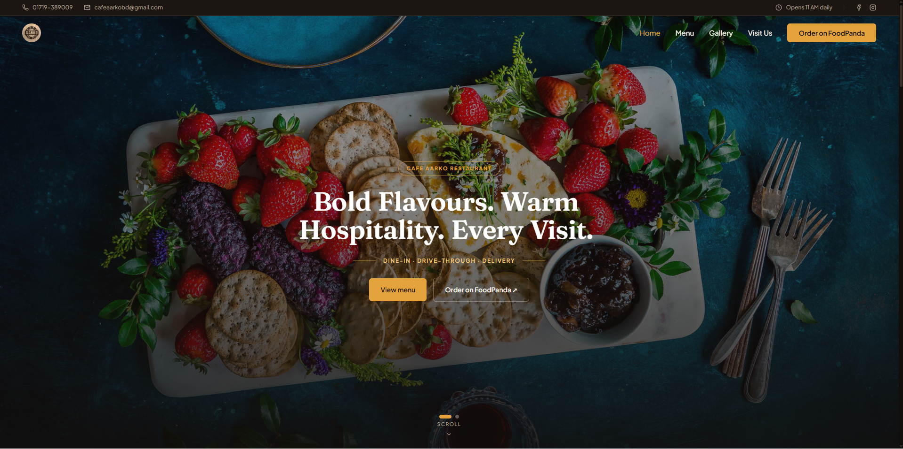
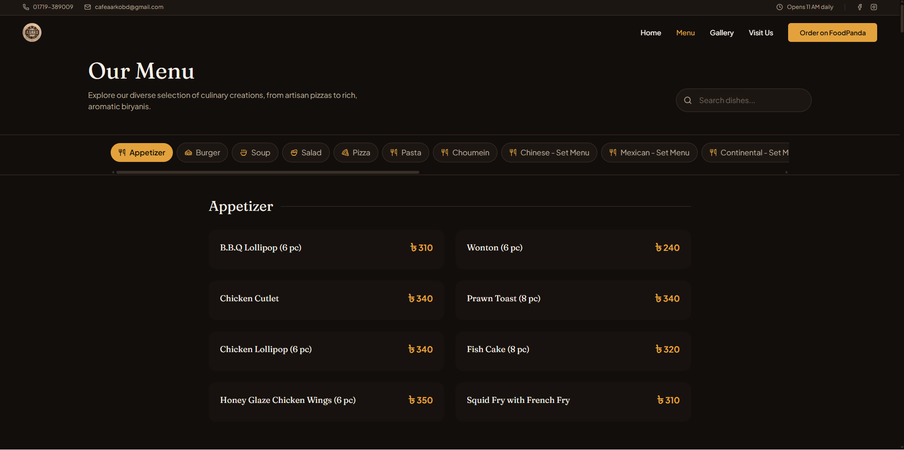

# Cafe Aarko

A modern, responsive restaurant website built for **Cafe Aarko**, designed to give the brand a polished digital presence and make its menu, atmosphere, and location easy to explore.

**Live Website:** https://cafe-aarko.vercel.app/

## Overview

Cafe Aarko is a production-style restaurant website created around a premium visual experience. The project combines strong imagery, typography, responsive layouts, interactive sections, and intentional motion to represent the restaurant brand across desktop and mobile devices.

The website focuses on three things: **brand presentation, menu discovery, and an easy path to visit or order**.

## Preview

### Homepage



### Menu



### Visit Us


## Highlights

- Responsive restaurant website experience
- Brand-focused hero and visual storytelling
- Interactive navigation and menu browsing
- Categorized menu with dish search
- Smooth scrolling and scroll-based animations
- Animated hero and content transitions
- Responsive image and content layouts
- Location, opening hours, and contact information
- Google Maps integration for location discovery
- Foodpanda ordering CTA
- Reusable React components
- Production deployment with Vercel

## Tech Stack

| Technology | Purpose |
|---|---|
| **Next.js** | React framework and application architecture |
| **React** | UI development and reusable components |
| **TypeScript** | Type-safe application development |
| **Tailwind CSS** | Responsive styling and design system |
| **GSAP** | Advanced animations and motion effects |
| **Motion** | UI and component animations |
| **Lenis** | Smooth scrolling experience |
| **Lottie React** | Lightweight animated visual elements |
| **Lucide React / Iconsax** | Interface icons |
| **shadcn** | Reusable UI components |
| **Vercel** | Deployment and hosting |

## Key Pages

### Home

A visual-first landing page that introduces Cafe Aarko through the restaurant's brand imagery, messaging, navigation, and primary ordering/menu actions.

### Menu

A structured digital menu with category navigation and dish search, allowing visitors to quickly browse available items and prices.

### Gallery

A visual section designed to showcase the restaurant, food, and overall dining atmosphere.

### Visit Us

Provides the restaurant address, opening hours, contact details, map location, and directions CTA so visitors can easily find the venue.

## Design & Development Focus

The project emphasizes:

- **Visual storytelling** — using imagery, typography, spacing, and motion to communicate the restaurant brand.
- **Responsive design** — adapting the experience for different screen sizes and devices.
- **Motion design** — using GSAP, Motion, Lenis, and Lottie to create intentional transitions and interactions.
- **Component reusability** — keeping the frontend organized around reusable React components.
- **User experience** — making important actions such as viewing the menu, ordering, and finding the restaurant easy to access.
- **Modern frontend engineering** — using Next.js, TypeScript, and Tailwind CSS for a maintainable codebase.

## Project Structure

```text
cafe_aarko/
├── app/                # Application routes and pages
├── components/         # Reusable UI components
├── design-system/      # Design-system resources
├── photo/              # Project imagery and assets
├── public/             # Public static assets
├── screenshots/        # Project preview screenshots
├── next.config.ts      # Next.js configuration
├── components.json     # UI component configuration
├── package.json        # Dependencies and scripts
└── README.md           # Project documentation
```

## Getting Started

### 1. Clone the repository

```bash
git clone https://github.com/adnan1299otm/cafe_aarko.git
cd cafe_aarko
```

### 2. Install dependencies

```bash
npm install
```

### 3. Start the development server

```bash
npm run dev
```

Open **http://localhost:3000** in your browser.

## Available Scripts

```bash
npm run dev      # Start the development server
npm run build    # Create a production build
npm run start    # Start the production server
npm run lint     # Run ESLint
```

## Deployment

The website is deployed on **Vercel** and is available at:

**https://cafe-aarko.vercel.app/**

## Project Status

**Live & maintained**

This repository serves as a portfolio example of modern restaurant-focused web development, combining visual design, responsive frontend engineering, and interactive motion.

## Author

**Arafath Al Adnan**

Software Engineer | AI Builder | Full-Stack Developer

- GitHub: https://github.com/adnan1299otm
- LinkedIn: https://www.linkedin.com/in/arafathaladnan/

---

Built with Next.js, TypeScript, and modern web technologies for Cafe Aarko.
